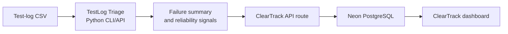

Clinic’s equipment system
  “We own device DEF-1042 and its normal location is ER Bay 3.”

                ↓ device arrives for service

ClearTrack database
  “DEF-1042, owned by Evergreen Clinic,
   received Aug 24, inspected by Diane,
   awaiting parts, currently in our warehouse.”

   A secure link is passwordless login for one narrowly defined action. The clinic contact does not create a username/password or access your internal app—but they do prove they control the approved email inbox.

There is no way for an external clinic to create trusted requests without some form of identity verification. Otherwise, it is just an internet form with a nicer hat.

A secure link is **passwordless login for one narrowly defined action**. The clinic contact does not create a username/password or access your internal app—but they do prove they control the approved email inbox.

The flow would be:

1. A ClearTrack admin adds an approved clinic contact: `biomed@evergreenclinic.org`.
2. ClearTrack emails that address a unique request link.
3. The contact clicks it and opens the service-request form.
4. The server knows, from the link, that this request is for **Evergreen Clinic**.
5. They submit it; ClearTrack generates `CT-2026-000123`.
6. The link expires or is consumed, so it cannot be reused.

Technically, the URL contains a long, random one-time token. The database stores only a hash of it, associates it with the clinic/contact, makes it expire—say in 24 hours—and marks it used after submission. Same security idea as a password-reset link.

So: do they “log in”?

* **In a practical sense:** yes, by proving control of their email inbox.
* **In the user experience:** no password, account setup, or dashboard; they click a link and submit one ticket.
* **In your Microsoft SSO model:** absolutely unaffected. Microsoft Entra remains worker-only.

If you eventually want clinics to log in anytime, view old requests, download documents, etc., then they need a real external portal account. It could use email magic links rather than passwords, but it is still a separate customer-auth system alongside worker Entra SSO.

For this project, I’d use the one-time request link. It demonstrates controlled external intake without ballooning ClearTrack into a customer identity-management project.

Next.js — the web application framework (App Router).
TypeScript — safer JavaScript and better tooling.
React — UI components underneath Next.js.
Tailwind CSS — styling and responsive layout.
shadcn/ui + Radix UI — accessible UI building blocks when we need them.
Recharts — dashboard charts, including the equipment-status donut chart.
Auth.js / NextAuth — authentication integration in the app.
Microsoft Entra ID — staff single sign-on and identity provider.
Neon PostgreSQL — hosted production database.
Prisma — database schema, migrations, queries, and type-safe database access.
@prisma/adapter-neon — lets Prisma connect cleanly to Neon’s serverless Postgres setup.
Vercel (planned) — deployment and hosting for the Next.js app.
GitHub + GitHub Actions (planned) — source control, pull requests, and eventually CI checks.
Nice-to-have pieces we decided on, but have not built yet:

Resend or similar — secure request/service-link emails for clinic contacts.
Cloudinary or Vercel Blob — only if we later decide calibration certificates or service photos need stored files. Right now, we are deliberately storing certificate details, not files. Paper is apparently still allowed to exist.

Next.js, TypeScript, React, Tailwind, shadcn/ui/Radix, Recharts, Auth.js, Microsoft Entra ID, Neon PostgreSQL, Prisma, Cloudinary, Resend, React Email, Vercel, and GitHub Actions.

Future Me:
ClearTrack and TestLog Triage should connect through an API—not by sharing a database directly. Shared databases turn two clean projects into one tangled organism with a future support ticket already brewing.

The setup:



TestLog Triage’s job is to read test logs and turn them into useful findings:

* Device serial number or internal device ID
* Test date/time
* Total checks, passed checks, failed checks
* Error-code counts
* Overall result
* Flagged reliability concern, if applicable

ClearTrack’s job is to receive those findings, attach them to the correct equipment record, and make them actionable:

* Show recent test failures on the equipment detail page.
* Flag a device as needing inspection or service review.
* Create a service-request draft for a technician to review.
* Show recurring error codes across units on the dashboard.
* Preserve the imported result as part of the equipment quality history.

The actual connection would be a protected endpoint in ClearTrack, something like:

```text
POST /api/integrations/testlog-triage/results
```

TestLog Triage sends JSON such as:

```json
{
  "source": "testlog-triage",
  "externalRunId": "run_2026_08_25_001",
  "deviceSerialNumber": "DEFIB-204",
  "testedAt": "2026-08-25T16:30:00Z",
  "totalChecks": 8,
  "passedChecks": 5,
  "failedChecks": 3,
  "errorCodeCounts": {
    "ECG_LEAD_DISCONNECT": 2,
    "CHARGE_TIMEOUT": 1
  },
  "overallResult": "FAIL"
}
```

ClearTrack validates a secret API key, finds `DEFIB-204`, and creates records such as:

* `TestRun`
* `TestFailure` or `TestFinding`
* optionally a `ServiceRequest` in `Needs review` status

Important design rule: **do not let a Python analysis automatically mark a real defibrillator out of service.** It can flag and recommend; a qualified human reviews and changes the readiness state. That distinction makes the project more credible—and much less terrifying in an interview.

It analyzes the CSV, then posts the summary to ClearTrack. Later, if you want a polished demo, we can add a drag-and-drop upload page inside ClearTrack that passes the file to the Python analyzer through a small service.


flowchart TD
    A["Device received"] --> B["Create inbound custody event"]
    B --> C{"Why is it here?"}

    C -->|"Reported fault / RMA"| D["Create Service Request"]
    C -->|"Scheduled calibration"| E["Create calibration work"]
    C -->|"Routine inspection"| F["Create inspection work"]
    C -->|"Transfer / return"| G["Intake assessment"]

    D --> G
    E --> G
    F --> H["Perform inspection"]
    G --> I{"Repair needed?"}

    I -->|"Yes"| J["Repair work + parts/notes"]
    I -->|"No"| K{"Calibration due or required?"}
    J --> K

    K -->|"Yes"| L["Calibrate and record measurements"]
    K -->|"No"| M["Final functional inspection"]
    L --> M
    H --> N{"Inspection passed?"}
    N -->|"No"| D
    N -->|"Yes"| O["Ready for shipment"]

    M --> P{"Final inspection passed?"}
    P -->|"No"| D
    P -->|"Yes"| O

    O --> Q["Resolve Service Request, if one exists"]
    Q --> R["Create outbound custody event"]
    R --> S["Ship device"]