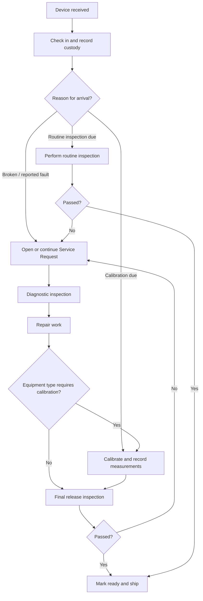

```mermaid
flowchart TD
    A["Device received"] --> B["Check in and record custody"]
    B --> C{"Reason for arrival?"}

    C -->|"Broken / reported fault"| D["Open or continue Service Request"]
    C -->|"Calibration due"| J["Calibrate and record measurements"]
    C -->|"Routine inspection due"| F["Perform routine inspection"]

    D --> G["Diagnostic inspection"]
    G --> H["Repair work"]
    H --> I{"Equipment type requires calibration?"}

    I -->|"Yes"| J
    I -->|"No"| K["Final release inspection"]

    J --> K
    K --> L{"Passed?"}
    L -->|"No"| D
    L -->|"Yes"| M["Mark ready and ship"]

    F --> N{"Passed?"}
    N -->|"No"| D
    N -->|"Yes"| M
```